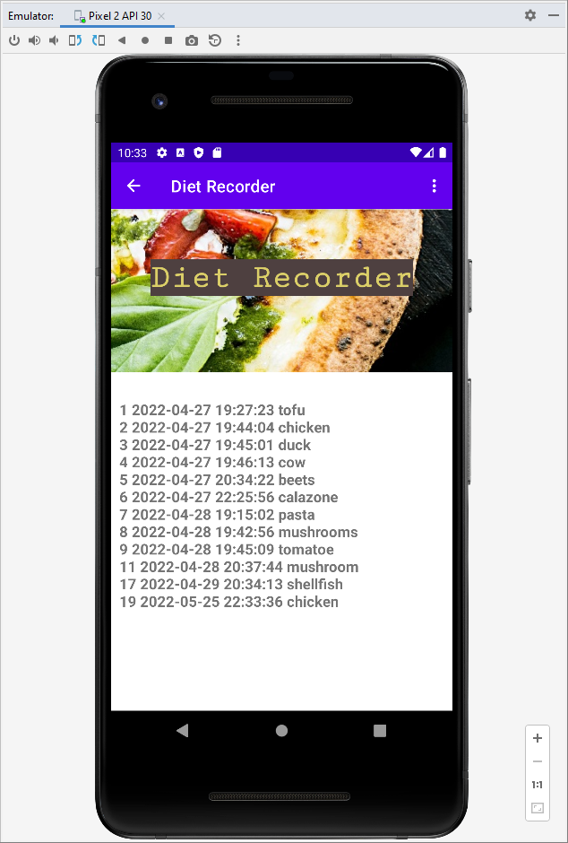
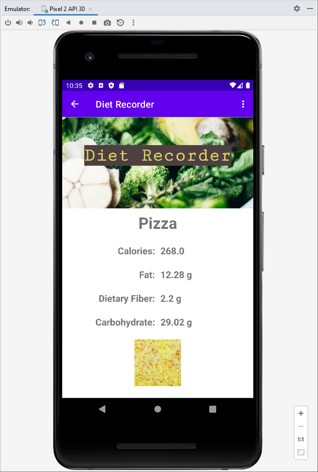

# DietRecorder
Android App to Record Your Diet

This program will require an edamam account to access the stats of any foods you want to look up (https://www.edamam.com/). Once your edamam account is created, add your API key and API id to the ThirdViewModel.kt file.

